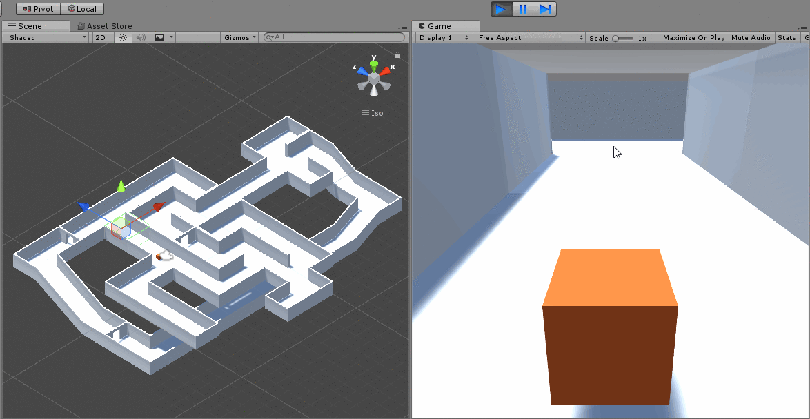

# Workshop 1: Unity Editor UI, Scene Creation and Project Hierarchy
* [Livestream](https://www.facebook.com/gamedevnl/videos/764420013898522/?__xts__[0]=68.ARDIcp_pvSkntFeFHGddsKz-ZfH8dAmkTE5_97gFK2Bq19_mmJy7uC_V2_IxO_GuQiAqQeGvajRbHAkjXIHXDjVETYV274ZEv7HJU9wInok9psp_C01pLWEAHiqn-_46wm1cEUfWrsra0jc3--mAZkapArXQPDTXSesH5xVBFx79lvIfPlCqfwrYJsXOBQgLDTC7FyRB27TfT9Lgm2SY7QKwWX0YD21mmYCqyHkh9O0&__tn__=-R)

## Lesson Plan
* High level overview of main windows
* Toolbar & Scene View / Game View
  * Hand Middle Mouse
  * Switch Gizmos (WER)
* Center/Pivot
* Local/Global
* Play/Pause/Stop
* Layouts and Managing Windows
* Console
* Project Window
  * Explorer
  * Meta Files
* Inspector View
  * Transforms
  * Active/Inactive
  * Components (Data Types)
  * Live Editing
* Snap Settings
  * Vertex Snap
* Duplicate (Ctrl+D)
* Intro to scripting
